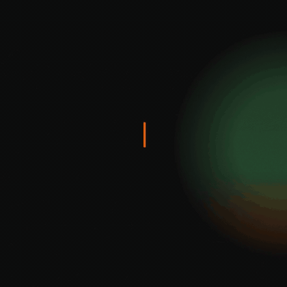

# Motion

Two agent skills for 9k video: motion graphics from a brief, and full edits of your own footage. They share one 9k design system (design.the9klabs.com), one canvas `seek(t)` engine, and one Playwright + ffmpeg render path.

| Skill | Input | Output |
|---|---|---|
| [`9k-motion`](skills/9k-motion/SKILL.md) | A brief: segment, promo, title card, end card | A motion film built from code. It starts with a questionnaire and asks for references |
| [`9k-montage`](skills/9k-montage/SKILL.md) | **A video of you**: raw takes or a rough cut | The edited montage: tightened cut, jump-cut punch-ins, word-by-word Arabic/English captions, 9k graphics timed to the words, SFX, −14 LUFS, end card. There is one plan gate and no questionnaire |

Every frame is styled from the [9k identity](docs/identity.md): colors, type, the Ismail9k → 9k wordmark, Nino. Install it to make 9k content, not as a general-purpose motion kit.



## Guides

1. **[Install](docs/install.md)**: tools, the skills, model setup, and a first test
2. **[Finding references on whatships.com](docs/references.md)**: pick a launch film to borrow pacing and transitions from, and hand it to the skill
3. **[The course behind the skill](docs/course.md)**: the Movez article this is built on, and where each of its 12 steps lives in the skill
4. **[The 9k identity](docs/identity.md)**: the colors, type, wordmark, Nino and motion language every film is styled from

## Install

With the [Skills CLI](https://github.com/vercel-labs/skills), for Claude Code, Codex and other agents:

```bash
npx skills add ismail9k/motion
```

Install both skills: `9k-montage` copies its engine and brand files from the sibling `9k-motion` skill. The [install guide](docs/install.md) covers the tools, the whisper model and troubleshooting.

To hack on the skills, clone the repo and link them, so edits take effect immediately:

```bash
git clone https://github.com/ismail9k/motion && cd motion
ln -sfn "$PWD/skills/9k-motion" ~/.claude/skills/9k-motion
ln -sfn "$PWD/skills/9k-montage" ~/.claude/skills/9k-montage
```

## Requirements

- Node 20+ and npm (each project installs Playwright + Chromium and the IBM Plex fonts on scaffold)
- `ffmpeg` and `ffprobe`
- For 9k-montage: `whisper-cpp` (`whisper-cli`) with a multilingual ggml model in `~/.cache/hyperframes/whisper/models/`
- Optional: Python 3 with `numpy librosa soundfile` for beat-syncing a supplied music track
- Optional: the Thmanyah fonts for Arabic (otherwise IBM Plex Sans Arabic is used)

## Use

- Ask for a motion graphic, or type `/9k-motion`
- "Do the montage for <video>", or type `/9k-montage`
- By hand: `bash skills/9k-motion/scripts/new-film.sh ~/films/my-film`, or `bash skills/9k-montage/scripts/new-montage.sh <video>`, then follow the house rules in the generated `CLAUDE.md`

Projects are scaffolded into `~/films/` by default. A `films/` folder in this repo is ignored by git.
