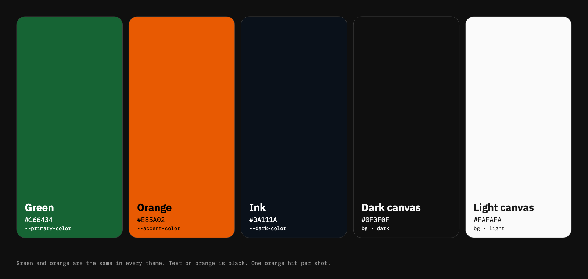
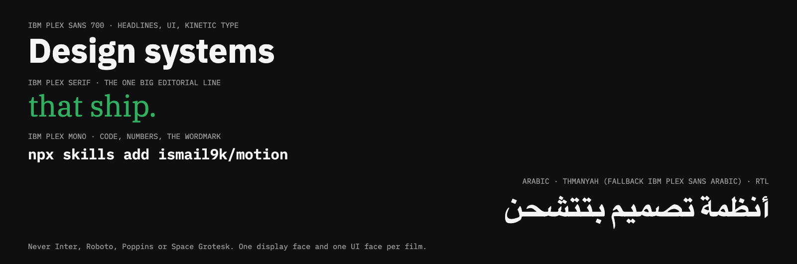
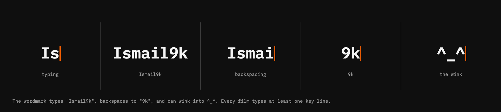
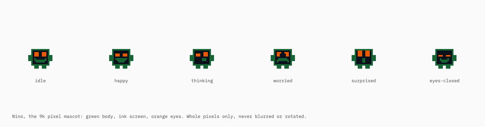
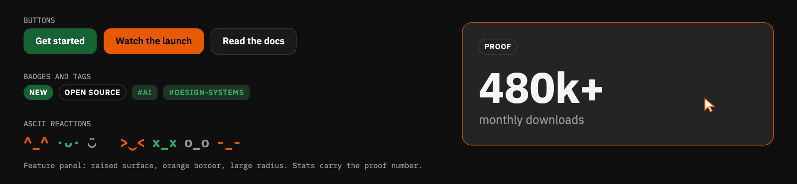
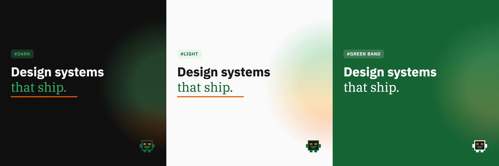

# The 9k identity

Every frame these skills render is styled from **9k**, the identity of Ismail9k and 9K Labs. Its source of truth is the 9k design system at [design.the9klabs.com](https://design.the9klabs.com). The skills carry a motion version of it, so a title card, a launch film and a montage all look like they came from the same studio.

This guide shows what the identity is, how it moves, and the rules the skills hold to. Every image here was rendered by the skills' own engine, so it's exactly what you'll get.

## Personality

**Calm, precise, typed, and a little playful in the details.** 9k is not flashy. Motion has weight but doesn't bounce, text is typed rather than faded in, and the playfulness lives in small things: Nino's reactions, an ASCII wink, an orange caret.

## Color

- **Green `#166434`** is the brand. Green bands, primary buttons, solid badges, Nino's body.
- **Orange `#E85A02`** is the accent, and it gets **one hit per shot**: an underline, the cursor, a highlight, a key number. Text on orange is **black**, never white.
- **Ink `#0A111A`** is for Nino's screen and deep backgrounds.
- The **glow** is the only gradient allowed: a big, soft green-to-amber-to-orange circle half off-screen at an edge, drifting slowly under fine grain. It's always background and never sits behind small text.

Green and orange are identical in every theme. The full token list, including every theme color, is in [`brand.md`](../skills/9k-motion/references/brand.md).

## Type

| Role | Face |
|---|---|
| Headlines, UI, kinetic type | IBM Plex Sans 700 (600 for UI) |
| The one big editorial line or quote | IBM Plex Serif |
| Code, terminal, numbers in UI, the wordmark | IBM Plex Mono |
| Arabic | Thmanyah Sans and Thmanyah Serif Display, falling back to IBM Plex Sans Arabic. Right to left, with the layout mirrored |

One display face and one UI face per film. Headlines at phone size are at least 96 px on a 1080-wide frame.

## The wordmark

The wordmark is typed, not placed. It types **Ismail9k** with an orange caret, backspaces down to **9k**, and at rest can wink into `^_^` before typing back. It opens intros, and the end card is always the bare **9k**.

Typing is the identity's signature, so every film types at least one key line, not only the wordmark.

## Nino

Nino is the 9k pixel mascot: a green body, an ink screen, orange eyes and a green mouth, drawn on a 16×16 grid. He has six expressions, blinks every few seconds, bobs when he's thinking and shivers when he's worried.

- He's the only thing allowed a visible bounce.
- Whole pixels only. Never blurred, rotated or smoothed.
- On the green band his body turns white, because green on green disappears.

## Details

- **Buttons:** green with white text, orange with black text, or a quiet bordered secondary.
- **Badges and tags:** uppercase Plex Sans. Tags take a leading `#`, like `#ai` and `#design-systems`.
- **ASCII reactions:** `^_^ ·ᴗ· >‿< x_x o_o -_-` as small beats and punctuation.
- **Proof numbers:** a big value with a small label, usually inside the *feature panel*: a raised surface with an orange border and large radius.
- **The cursor:** an arrow with an orange outline that drives real product UI.

## Themes

Every film picks one theme: **dark**, **light** or the **green band**, a full-bleed green with white text. The green band is for climaxes, calls to action and title cards, and can appear as the payoff inside a dark film. Arabic films mirror everything: text aligns right, and the glow and Nino's gaze flip sides.

## Motion

| Thing | How it moves |
|---|---|
| Containers, cards, camera | A spring with almost no overshoot |
| Big type and logo lockups | A heavier spring with **zero** overshoot |
| Buttons, toggles, leading edges | A snappy spring |
| Nino | A playful spring, with visible overshoot |
| Text reveal | Typed, character by character, with a caret |
| Small UI state changes | A short ease, 160–300 ms |
| Ambient | The glow drifts over 20 seconds; grain is fixed per frame |

Something new happens every 2–4 seconds, and no beat sits dead for more than 4.

## Never

- Inter, Roboto, Poppins, Space Grotesk or system fonts
- A violet or teal accent, or any stock palette
- Gradients other than the glow, or gradients on UI
- Bouncy, elastic or back easing on text
- Everything fading in, or a centered title on a gradient
- Neon, lens flares, particle bursts, or glow on UI chrome
- More than one accent color in a shot
- White text on orange

## How references fit in

A reference you bring ([how to find one](references.md)) sets **pacing, transitions, camera and composition**. 9k sets **color, type and shape**. When they disagree, 9k wins: the skill keeps a reference's rhythm and restates its look in 9k tokens. Product screenshots stay exactly as they are, framed inside 9k.

## Where it lives

- **[design.the9klabs.com](https://design.the9klabs.com)** is the source of truth: the `@9klabs/design` Vue design system and its tokens.
- **[`brand.md`](../skills/9k-motion/references/brand.md)** is the motion version the skills read: every token, the motion language and the signature elements.
- **[`brand.js`](../skills/9k-motion/templates/lib/brand.js)** is the code: the colors, fonts, glow, wordmark, Nino and components every film draws with.

When the design system changes, update `brand.md` and `brand.js` together.

These skills are built for 9k content. To make films in your own brand, fork the repo, replace those two files, and rewrite the 9k-specific rules and questions in the `SKILL.md` and `questionnaire.md` files. The engine and the critique loop carry over unchanged.

Back: [Install](install.md) · [Finding references](references.md) · [The course behind the skill](course.md)
